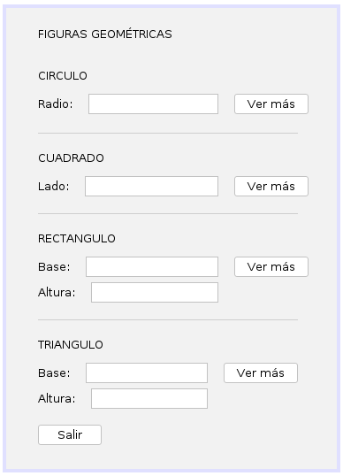
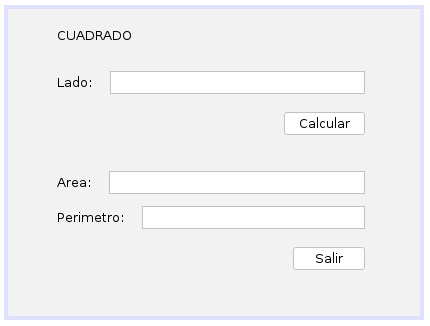
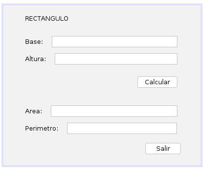
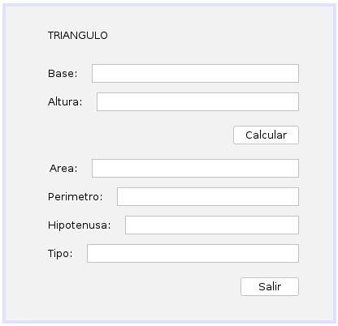
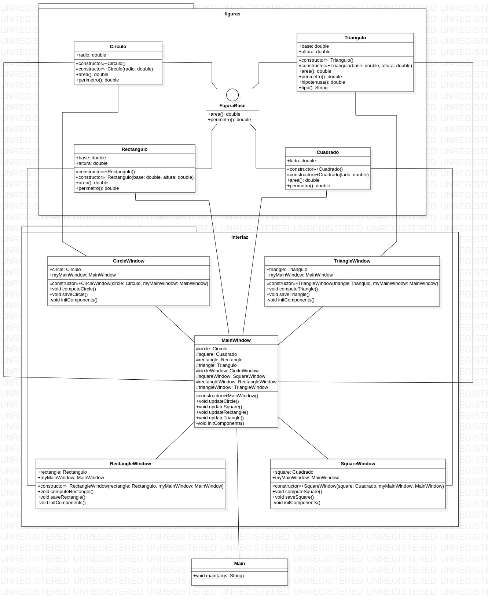

# Ejercicio Clases Figuras Geométricas

### Enunciado
Se requiere un programa que modele varias figuras geométricas: el círculo, el rectángulo, el cuadrado y el triángulo rectángulo.
* El círculo tiene como atributo su radio en centímetros.
* El rectángulo, su base y altura en centímetros.
* El cuadrado, la longitud de sus lados en centímetros.
* El triángulo, su base y altura en centímetros.

Se requieren métodos para determinar el área y el perímetro de cada figura geométrica.
Además, para el triángulo rectángulo se requiere:
* Un método que calcule la hipotenusa del rectángulo.
* Un método para determinar qué tipo de triángulo es:
    * Equilátero: todos sus lados son iguales.
    * Isósceles: tiene dos lados iguales.
    * Escaleno: todos sus lados son diferentes.

Se debe desarrollar una clase de prueba con un método main para
crear las cuatro figuras y probar los métodos respectivos.

### Interfaces gráficas
* #### Ventana principal
> 
* #### Ventana del Círculo
> 
* #### Ventana del Cuadrado
> 
* #### Ventana del Rectángulo
> 
* #### Ventana del Triángulo
> 

### Diagrama de clases (UML)

