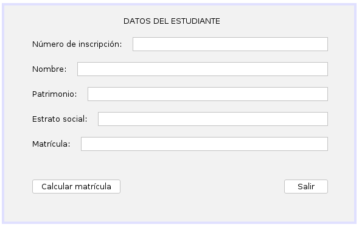

# Ejercicio 10 del capítulo 4

### Enunciado
Cierta universidad para liquidar el pago de matrícula de un estudiante le exige los
siguientes datos:
* Número de inscripción
* Nombres
* Patrimonio
* Estrato social

La universidad cobra un valor constante para cada estudiante de $50.000. Si el patrimonio es mayor que $2´000.000 y el estrato superior a 3, se le incrementa un porcentaje del 3% sobre el patrimonio. Hacer un algoritmo que muestre:
* Número de inscripción.
* Nombres.
* Pago de matrícula.

### Interfaz gráfica

