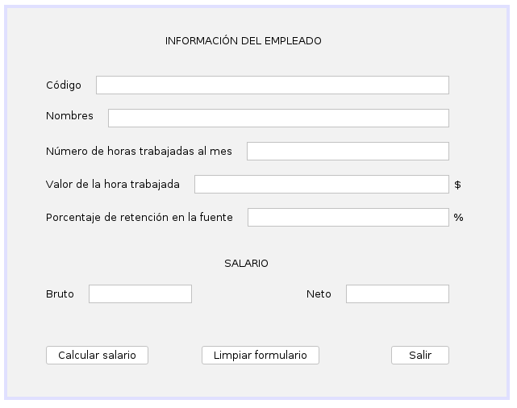

# Ejercicio 18 del capítulo 3

### Enunciado
Se tiene la siguiente información de un empleado:
* código del empleado
* nombres
* número de horas trabajadas al mes
* valor hora trabajada
* porcentaje de retención en la fuente

### Interfaz gráfica

