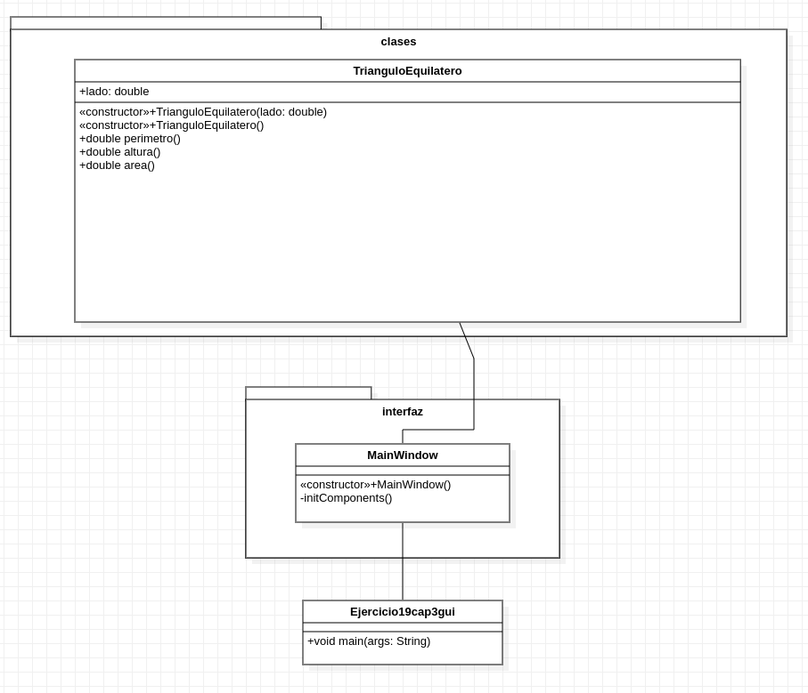

# Ejercicio 19 del capítulo 3

### Enunciado
Dado el valor del lado en un triángulo equilátero, haga un algoritmo que obtenga el
perímetro, el valor de la altura y el área del triángulo.

### Interfaz gráfica

### Diagrama de clases (UML)

