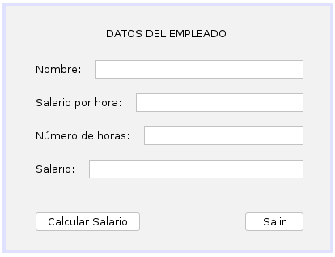
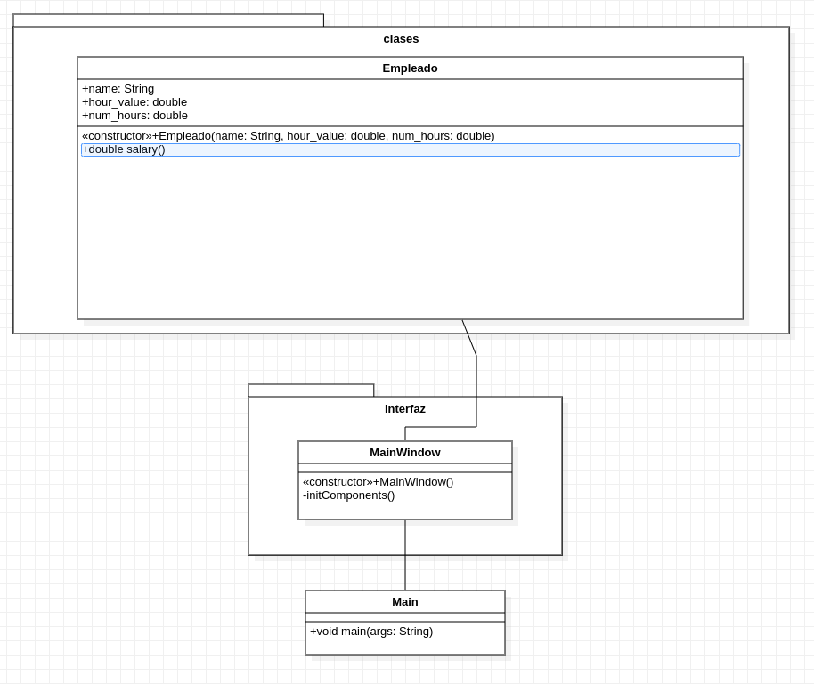

# Ejercicio 22 del capítulo 4

### Enunciado
Elaborar un algoritmo que entre el nombre de un empleado, su salario básico por hora y el número de horas trabajadas en el mes; escriba su nombre y salario mensual si éste es mayor de $450.000, de lo contrario escriba sólo el nombre.

### Interfaz gráfica

### Diagrama de clases (UML)

