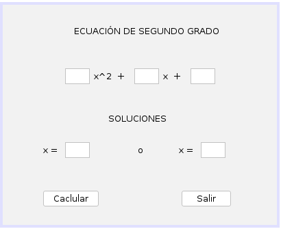
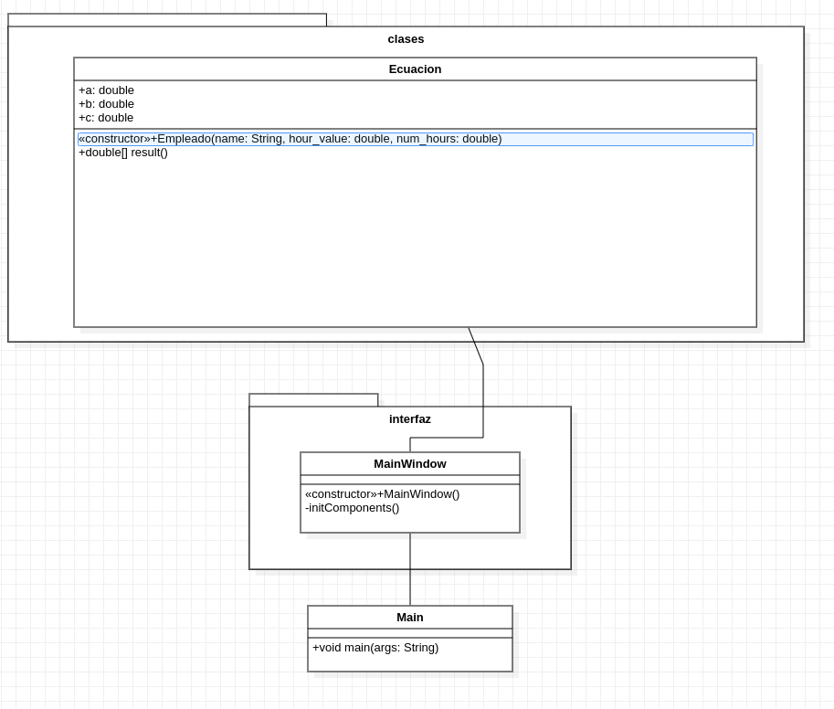

# Ejercicio 23 del capítulo 4

### Enunciado
Dados los valores A, B y C que son los parámetros de una ecuación de segundo grado, elaborar un algoritmo para hallar las posibles soluciones de dicha ecuación.

### Interfaz gráfica

### Diagrama de clases (UML)

