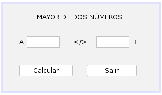
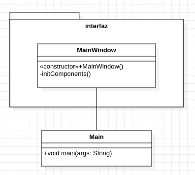

# Ejercicio 7 del capítulo 4

### Enunciado
Hacer un algoritmo que, dados dos valores numéricos A y B, escriba un mensaje diciendo
si A es mayor, menor o igual a B

### Interfaz gráfica

### Diagrama de clases (UML)

