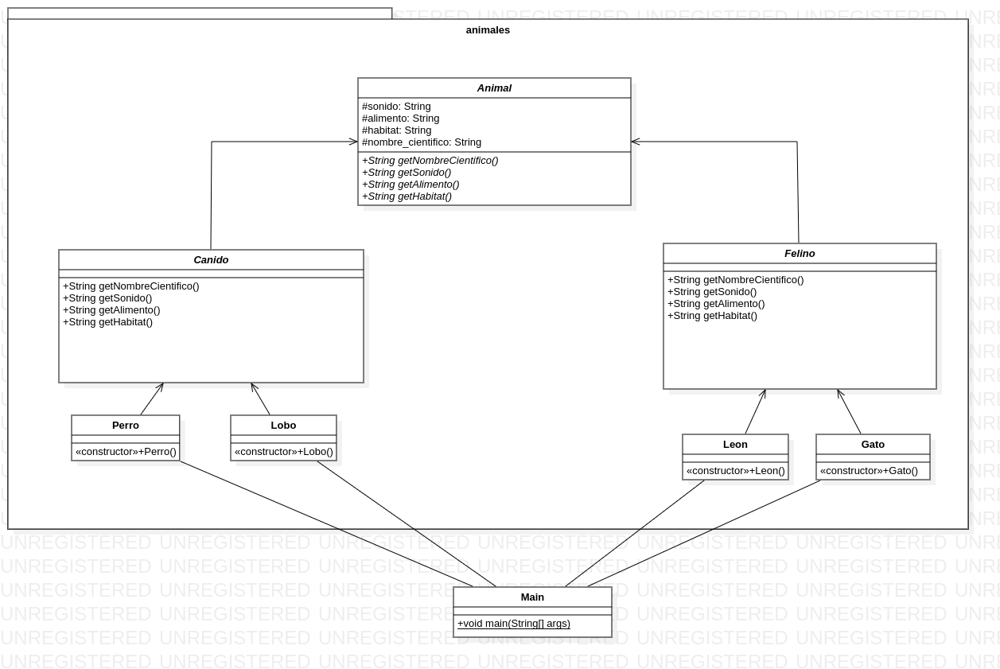

# Ejercicio 4.3 (Clases abstractas)

## Enunciado del ejercicio:
Se tiene una jerarquía taxonómica con los siguientes animales:
* Animal es la clase raíz con los atributos: sonidos, alimentos, hábitat y nombre científico (todos de tipo String). Esta clase tiene los
siguientes métodos abstractos:
    * public abstract String getNombreCientífico()
    * public abstract String getSonido()
    * public abstract String getAlimentos()
    * public abstract String getHábitat()
* Los cánidos y los felinos son subclases de Animal.
* Los perros son cánidos, su sonido es el ladrido, su alimentación es
carnívora, su hábitat es doméstico y su nombre científico es Canis
lupus familiaris.
* Los lobos son cánidos, su sonido es el aullido, su alimentación es
carnívora, su hábitat es el bosque y su nombre científico es Canis
lupus.
* Los leones son felinos, su sonido es el rugido, su alimentación es
carnívora, su hábitat es la pradera y su nombre científico es Panthera leo.
* Los gatos son felinos, su sonido es el maullido, su alimentación
son los ratones, su hábitat es doméstico y su nombre científico es
Felis silvestris catus.

Además, se requiere en una clase de prueba para desarrollar un método main que genere un array de animales y la pantalla debe mostrar los
valores de sus atributos.

## Diagrama de clases (UML)

