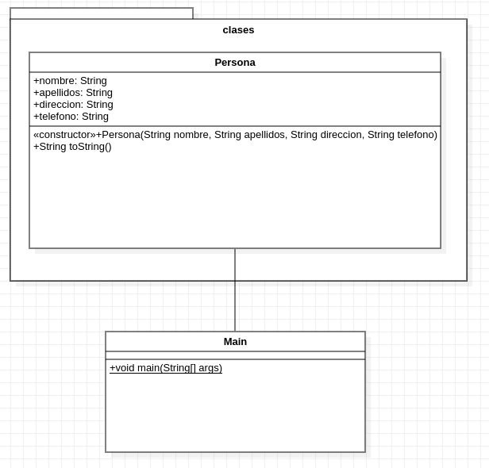

# Ejercicio 8.1 (Javax Swing)

## Enunciado del ejercicio:
Se requiere desarrollar un programa con una interfaz gráfica de usuario que
genere una ventana para solicitar los datos de una persona: nombre, ape-
llidos, dirección y teléfono, todos de tipo String. Una vez se reciban estos
datos, la persona se debe agregar a una lista de personas.
La lista se puede consultar y si se selecciona una persona específica, es
posible eliminar la persona seleccionada. También se permite borrar todas
las personas de la lista.

## Diagrama de clases (UML)

## Video de funcionamiento del programa
[Video de funcionamiento](./Funcionamiento.webm)
