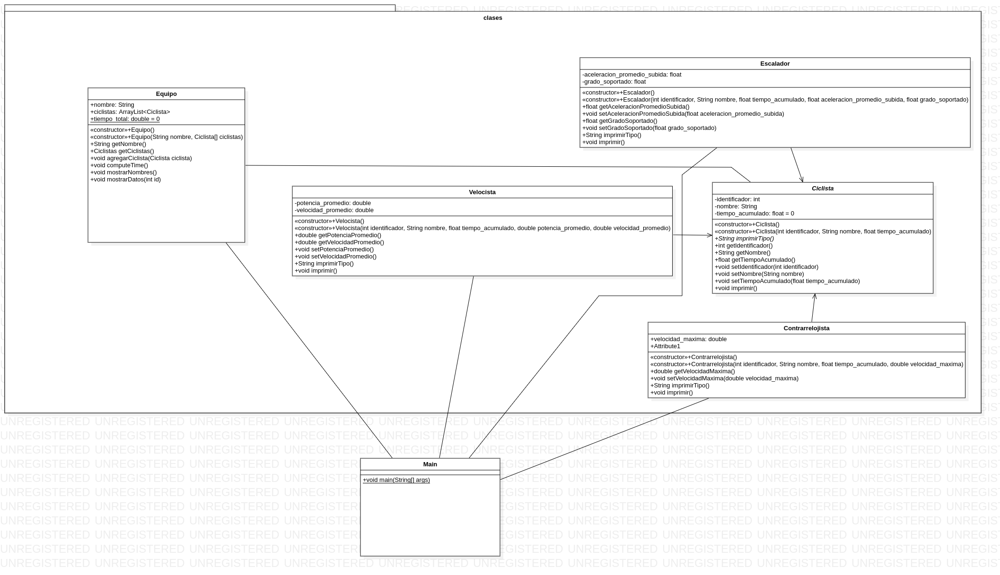

# Ejercicio 4.8 (Métodos abstractos)

## Enunciado del ejercicio:
En una carrera ciclística, un equipo está conformado por un conjunto de
ciclistas y se identifica por el nombre del equipo (tipo String), la suma de
los tiempos de carrera de sus ciclistas en minutos (atributo estático) y país
del equipo. Sus atributos deben ser privados.
Un ciclista es una clase abstracta que se describe con varios atributos:
identificador (de tipo int), nombre del ciclista y tiempo acumulado de carrera
(en minutos, con valor inicial cero). Los atributos deben ser privados.
Un ciclista tiene un método abstracto imprimirTipo que devuelve un String.
Los ciclistas se clasifican de acuerdo con su especialidad (sus atributos
deben ser privados y sus métodos protegidos). Estas especialidades no
son clases abstractas y heredan los siguientes aspectos de la clase Ciclista:
* Velocista: tiene nuevos atributos como potencia promedio (en vatios)
y velocidad promedio en sprint (Km/h) (ambos de tipo double).
* Escalador: tiene nuevos atributos como aceleración promedio en
subida (m/s 2 ) y grado de rampa soportada (grados) (ambos de tipo float).
* Contrarrelojista: tiene un nuevo atributo, velocidad máxima (km/h).

Definir clases y métodos para el ciclista y sus clases hijas para realizar
las siguientes acciones:
* Constructores para cada clase (deben llamar a los constructores de
la clase padre en las clases donde se requiera).
* Métodos get y set para cada atributo de cada clase.
* Imprimir los datos de un ciclista. Debe invocar el método de la
clase padre e imprimir los valores de los atributos propios.
* Método imprimirTipo que devuelve un String con el texto “Es un
xxx”. Donde xxx es la clase a la que pertenece.

La clase Equipo debe tener los siguientes métodos protegidos:
* Métodos get y set para cada atributo de la clase.
* Imprimir los datos del equipo en pantalla.
* Añadir un ciclista a un equipo.
* Calcular el total de tiempos de los ciclistas del equipo (suma de los
tiempos de carrera de sus ciclistas, su atributo estático).
* Listar los nombres de todos los ciclistas que conforman el equipo.
* Dado un identificador de un ciclista por teclado, es necesario imprimir
en pantalla los datos del ciclista. Si no existe, debe aparecer
el mensaje correspondiente.

En una clase de prueba, en un método main se debe crear un equipo
y agregar ciclistas de diferentes tipos.

## Diagrama de clases (UML)

## Video de funcionamiento del programa
[Video de funcionamiento](./Funcionamiento.webm)
