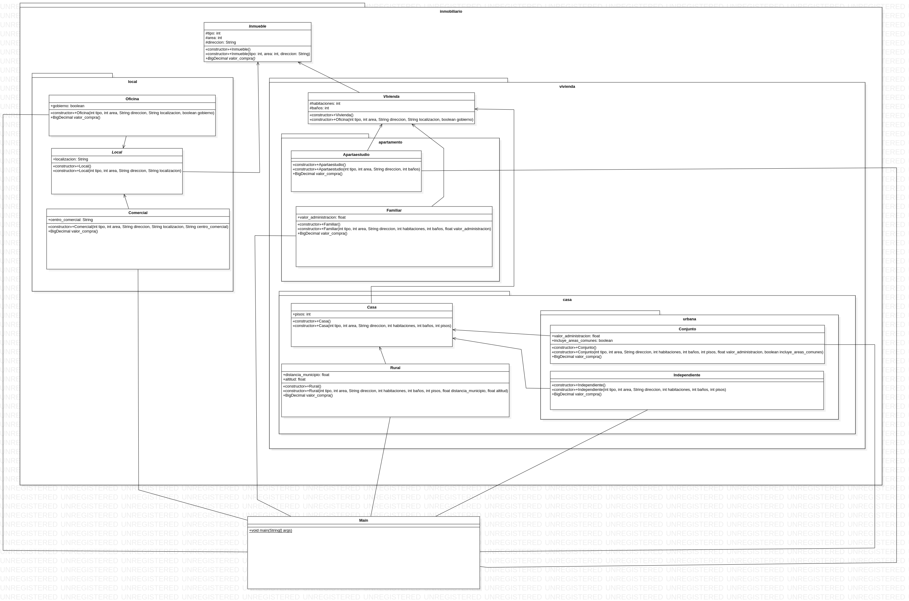

# Ejercicio 4.2 (Paquetes)

## Enunciado del ejercicio:
Se requiere realizar un programa que modele diferentes tipos de inmuebles.
Cada inmueble tiene los siguientes atributos: identificador inmobiliario (tipo
entero); área en metros cuadrados (tipo entero) y dirección (tipo String).
Los inmuebles para vivienda pueden ser casas o apartamentos. Los inmuebles para vivienda tienen los siguientes atributos: número de habitaciones y número de baños. Las casas pueden ser casas rurales o casas urbanas,
su atributo es la cantidad de pisos que poseen. Los atributos de casas rurales
son la distancia a la cabecera municipal y la altitud sobre el nivel del mar.
Las casas urbanas pueden estar en un conjunto cerrado o ser independientes. A su vez, las casas en conjunto cerrado tienen como atributo el valor de
la administración y si incluyen o no áreas comunes como piscinas y campos deportivos. De otro lado, los apartamentos pueden ser apartaestudios
o apartamentos familiares. Los apartamentos pagan un valor de administración, mientras que los apartaestudios tienen una sola habitación.
Los locales se clasifican en locales comerciales y oficinas. Los locales
tienen como atributo su localización (si es interno o da a la calle). Los locales comerciales tienen un atributo para conocer el centro comercial donde
están establecidos. Las oficinas tienen como atributo un valor boolean para
determinar si son del Gobierno. Cada inmueble tiene un valor de compra.
Este depende del área de cada inmueble según la tabla 4.2.

Inmueble -> Valor por metro cuadrado
Casa rural -> $ 1500000
Casa en conjunto cerrado -> $ 2500000
Casa independiente -> $ 3000000
Apartaestudio -> $ 1500000
Apartamento familiar -> $ 2000000
Local comercial -> $ 3000000
Oficina -> $ 3500000

## Diagrama de clases (UML)

